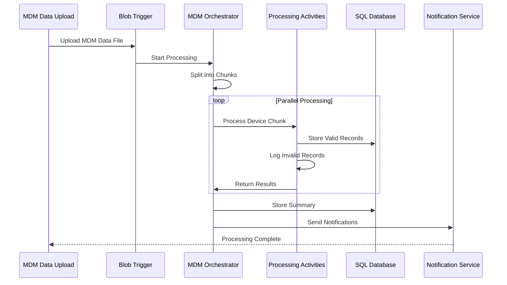

# File Processor - Device Management System

A Azure Durable Functions-based solution for processing large CSV files containing device information.

## Features

- Chunk-based processing of large CSV files
- Validation of device records
- Failed record handling and storage
- Automatic database upsert operations
- Scalable and resilient architecture

## System Components

### Activities

- **ChunkProcessingActivity**: Processes individual chunks of the CSV file
  - Validates device records
  - Stores valid records in SQL Database
  - Tracks failed records separately

## Architecture Overview

The solution uses Azure Durable Functions to process large MDM data files in chunks, implementing fan-out/fan-in pattern for parallel processing.

### Key Components

1. **Trigger**: Blob trigger that activates when new MDM data files are uploaded
2. **Orchestrator**: Coordinates the processing of MDM device data chunks
3. **Activities**: 
   - Device Data Chunk Processing
   - Summary Storage
   - Notification Service

### Flow Sequence

1. MDM data file uploaded to Azure Blob Storage
2. BlobTrigger initiates processing
3. Orchestrator splits file into manageable chunks
4. Parallel processing of device data chunks
5. Results consolidation and summary generation
6. Notifications sent to stakeholders

### Data Processing Rules

- Validates device data against business rules
- Stores valid records in SQL Database
- Tracks failed records separately
- Generates processing summaries
- Sends notifications via multiple channels

## Configuration

### Required App Settings
```json
{
  "AzureWebJobsStorage": "<storage-connection-string>",
  "SqlConnectionString": "<sql-connection-string>",
  "SendGridKey": "<sendgrid-api-key>",
  "TeamsWebhookUrl": "<teams-webhook-url>",
  "ChunkSize": "2000"
}
```

### Database Schema
```sql
CREATE TABLE DeviceInventory (
    DeviceId INT PRIMARY KEY,
    DeviceName NVARCHAR(100),
    SerialNumber NVARCHAR(100),
    OSVersion NVARCHAR(50),
    LastCheckIn DATETIME,
    ComplianceStatus NVARCHAR(50)
)
```

## Monitoring & Troubleshooting

- Processing summaries available via REST API
- Failed records tracking in Azure Table Storage
- Application Insights integration for monitoring
- Status notifications via email and Teams

## Sequence Diagram



## Error Handling

- Retry policies for transient failures
- Dead letter queue for failed messages
- Detailed error logging in Application Insights
- Error notifications to IT team

## Security

- Azure AD integration
- Role-based access control
- Data encryption in transit and at rest
- Secure connection strings and keys in KeyVault
